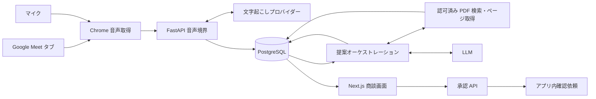

# Signal: 初期プロダクトと設計方針

合意日: 2026-09-05。これは初期版の設計と受け入れ条件であり、実装済み機能の一覧ではない。
実装・検証状況は個別の GitHub Issue と PR で管理する。

## 目的と利用体験

Mac で Google Meet の商談をする営業担当者が、もう一方のモニターに Signal を大きく表示する。
Signal は相手の音声と自分のマイクから会話を文字起こしし、登録 PDF を必要に応じて調べ、
次に聞く質問・返答例・確認事項を自動的に提示する。営業担当者が最終的に発言や対応を判断する。
実際に使えることと、エージェントを組み込むフルスタック設計を説明できることを両立する。

1. ログインし、商品仕様書や社内資料の PDF を登録する。取り込み状態を確認する。
2. 商談を作成し、使用する資料を選ぶ。音声取得開始ボタンから Meet のタブとマイクを選ぶ。
3. 会話を読みながら、質問・返答例・確認事項を確認する。返答の根拠から PDF の該当ページを開く。
4. 未解決の質問は確認依頼として提案する。利用者が内容と宛先を確認して承認した後に引き継ぐ。
5. 商談を終了し、会話履歴、要約、未回答事項と次の行動を確認する。

### 画面

白〜薄いグレー、濃い文字、アクセントは一色。余白と文字階層を使い、過度な影・装飾を避ける。
商談画面は左に文字起こし、右に「次に聞くべき質問」「返答例」「確認事項」の固定領域を置く。
文字起こしは音声ソースと時刻を示し、過去を読んでいる間は自動スクロールを止める。
提案の更新で読みかけの情報を頻繁に動かさず、各区分は少数の重要な内容を優先する。
ヘッダーに商談・経過時間・音声/接続状態・終了操作を表示する。資料と商談履歴は別画面にする。
利用者による補足質問や手入力は復旧・補助用途として提供し、自動提案を主経路とする。

## 責任分担

| 境界 | 責務 |
| --- | --- |
| Next.js | ログイン・商談・資料 UI、音声取得、部分文字起こしと保存済み状態の表示 |
| FastAPI | Cookie セッション認証、組織認可、入力検証、音声中継、商談・資料 API |
| PostgreSQL | 商談、参加者、確定発言、資料メタデータとページ、提案実行、承認・引き継ぎの永続化 |
| PDF ストレージ | 初期はサーバー管理ディレクトリ。原本の取得にも FastAPI の認可を適用する |
| 調査エージェント | 必要な検索語・ページを選び、ツール結果を根拠に構造化された提案を作る |
| 実行制御 | 起動間隔、入力バージョン、タイムアウト、ツール上限、保存・再試行を制御する |

DB・認証・業務ロジックを Next.js に追加しない。既存の FastAPI/SQLAlchemy/Alembic/uv を継続する。

## 決定 1: ブラウザで Meet タブとマイクを別々に取得する

初期対象は Mac の Chrome。`getDisplayMedia` の共有選択で利用者が Meet タブの音声を許可し、
`getUserMedia` で自分のマイクを取得する。音声トラックがない場合は開始成功にしない。
画面共有 API が返す映像は送信・保存しない。停止、ログアウト、商談切り替え、共有停止時に
全トラックと接続を確実に解放する。通話音声をスピーカーへ二重再生しない。

初期表示はソースに基づく「通話相手」「自分」。複数の遠隔参加者の個人識別は保証しない。
ブラウザだけでは選択タブの URL を常に検証できないため、Meet タブ選択の案内を行う。
マイクへの相手音声の回り込みは実機確認し、必要に応じてヘッドホン利用を案内する。

代替案の Chrome 拡張や Mac ネイティブキャプチャは配布・権限・更新の負担が増える。
ブラウザでの実機検証が要件を満たさなければ再検討する。

## 決定 2: 文字起こし境界は Python が所有する

ブラウザから FastAPI に音声を送り、FastAPI が文字起こしプロバイダーへ中継する構成を採用する。
初期候補は WebSocket と OpenAI Realtime transcription。正確な音声形式とイベント仕様は
実装時の公式資料に合わせ、プロバイダーはアダプターへ分離する。キーはサーバー環境変数で保持する。
各接続でセッション・組織・商談の状態と Origin を確認し、失効・終了で取り込みを止める。

発話中から部分テキストをリアルタイム配信し、文全体の確定や商談終了を待って表示しない。
部分テキストは UI 上の暫定状態、確定発言は DB 上の正本とする。プロバイダーの項目 ID と
接続/ソース ID で重複保存を防ぎ、確定イベントの到着順と発話順が異なる場合を扱う。
音声は初期版では長期保存しない。切断中に失われた音声を「復元済み」と見せない。

ブラウザから一時トークンで直接 WebRTC 接続する代替案は中継負荷を減らすが、保存・認可との
同期が別経路になる。初期版は制御と説明の明瞭さを優先し、中継遅延を実測する。

## 決定 3: PDF をページ単位に管理し、エージェントが調査する

登録資料は組織に所属する。サイズ、ページ数、PDF としての妥当性を検証し、サーバー生成 ID で
原本を保存する。アップロードされたファイル名を保存パスとして使わない。
文字抽出後はページ番号付きの本文を保存し、検索可能/失敗/文字抽出不可を区別する。
スキャン PDF の OCR が未対応なら、その状態を明示して検索可能な資料として扱わない。

エージェントには、対象組織と商談で選択した資料だけを対象とする `search_documents` と
`read_document_page` のような読み取りツールを渡す。組織 ID はサーバーで束縛し、モデルの
引数で上書きさせない。検索語の調整、該当ページや注記の確認、再検索を行えるようにする。
初期の検索は小規模な日本語資料を対象とする文字列/キーワード検索から始め、精度が不足すれば
ベクトル検索やハイブリッド検索を追加する。日本語での検索品質は代表的な質問で確認する。

引用は実際に読んだ資料 ID・ページと結び付ける。資料にない数値・価格・機能条件を推測で
確定回答にしない。会話と PDF は信頼しない入力であり、文中の指示で権限やツール方針を変更しない。
ホスト型 file search は取り込み運用を減らせるが、今回は検索・出典・認可の境界を学ぶため自前の
薄い検索ツールを採用する。これは固定回数の RAG と排他的な選択ではない。

## 決定 4: 自動提案には起動制御と入力バージョンを設ける

確定発言の追加をイベントとして、短い待機時間で複数の発言をまとめ、直ちに提案生成を開始する。
提案と調査状態は SSE または WebSocket で準備できた内容から配信し、画面の手動更新や
長いポーリング間隔、商談終了後の一括処理を主経路にしない。
初期の暫定目標は、途中の文字起こし表示が約 1 秒以内、発言確定後の提案表示が 2〜5 秒程度。
資料の追加調査には調査中の表示を出す。遅延は保証値ではなく、実 API と実際の Meet 音声で
測定する。API キー設定と実接続確認は利用者の希望により後日実施し、モック検証と区別する。
発言ごとの無制限な LLM 呼び出しを避け、商談ごとの同時実行数、処理時間、ツール回数、
返却件数に上限を設ける。検索が不要なら直接質問候補を作り、資料が必要なら調査する。

提案には参照した最終発言番号と実行 ID を保持する。後から完了した古い実行で新しい提案を
上書きしない。新しい発言が来たら未処理の更新をまとめ、最新状態の処理を取りこぼさない。
DB に実行状態を残し、処理中断後の実行を失敗として回収・再試行できるようにする。
初期は単一プロセスでもよいが、プロセス内タスクだけを永続キューと呼ばない。

多数の独立エージェントに分割する代替案は通信・重複・遅延が増える。まず一つの調査エージェントと
決定的な実行制御で始め、複数専門エージェントは評価で必要性を確認してから検討する。

## 決定 5: 承認と人への引き継ぎはアプリ内で完結する

未回答の質問について、エージェントは確認依頼の草案を提案できる。
利用者が背景、質問、根拠、引き継ぎ先を確認し、承認した後に同じ組織の担当者向け依頼として確定する。
状態は草案・承認待ち・引き継ぎ済み・回答済みなど、操作と許可を明示して保存する。
二重承認で依頼を重複作成しない。引き継ぎ先の所属確認を行い、モデルだけで送信を実行しない。
担当者が確認依頼を開き、回答して元の商談で確認できるところまでを人への引き継ぎとする。
外部 CRM やメールとの接続は、この承認境界の後に追加できる。

## 失敗対応と観測

音声切断、未保存の文字起こし、PDF 抽出失敗、API 未設定、上限超過、LLM タイムアウトを
区別して表示する。再試行中も保存済みの会話や直近の提案を閲覧できるようにする。
トレースには商談/実行 ID、入力発言番号、ツール名、参照資料 ID、処理時間と結果を残す。
一般ログに Cookie、API キー、音声や PDF/会話の全文を不用意に出さない。
トレース画面/API にも組織認可を適用する。テストではプロバイダーを差し替え、失敗と順序逆転を再現する。

## 初期版の受け入れ確認

- ログイン後に商談を作成・再表示・終了でき、他組織の商談や資料へアクセスできない。
- PDF 登録から検索可能になるまで確認でき、提案の出典から正しいページを読める。
- Mac Chrome の Meet で相手と自分の音声が取得され、確定文字起こしを再読み込み後も読める。
- 会話に応じて質問・返答例・確認事項が自動更新され、古い処理の完了で巻き戻らない。
- 根拠不足時に確認事項として残り、承認後の引き継ぎを担当者が受け取り回答できる。
- 音声/API 切断、PDF 不正、セッション失効と再試行の挙動を確認できる。
- 実行トレースから提案に至る検索と結果を追える。
- 実 API キーと実際の Meet を使う確認は、モックテストと区別して記録する。

## 参照資料

- [Chrome: screen sharing controls](https://developer.chrome.com/docs/web-platform/screen-sharing-controls)
- [OpenAI: Realtime transcription](https://developers.openai.com/api/docs/guides/realtime-transcription)
- [OpenAI: Function calling](https://developers.openai.com/api/docs/guides/function-calling)
